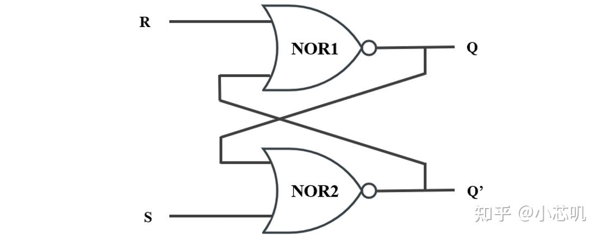
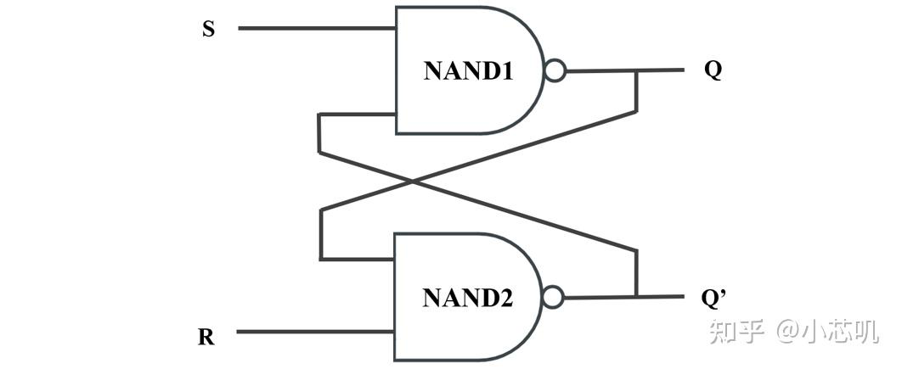
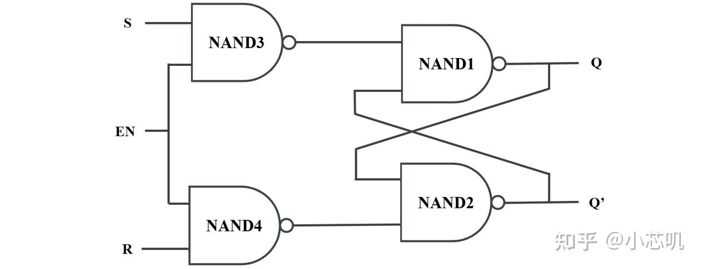

# 半导体存储电路

Ref：

- [SR锁存器、D锁存器](https://vlab.ustc.edu.cn/guide/doc_simple_timing.html)
- [深入理解锁存器：SR锁存器、门控SR锁存器、门控D锁存器介绍](https://zhuanlan.zhihu.com/p/1938209046684505714)

Basic：

- SR Latch

- Gated SR Latch

- D Latch

- D Flip-Flop

